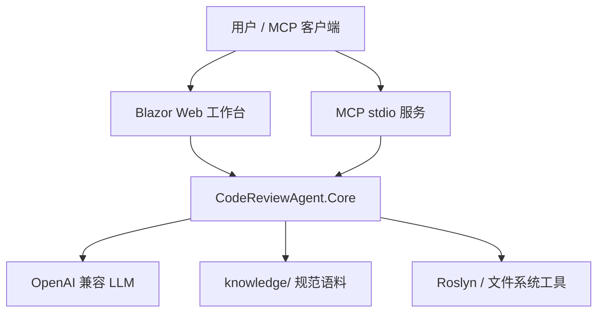
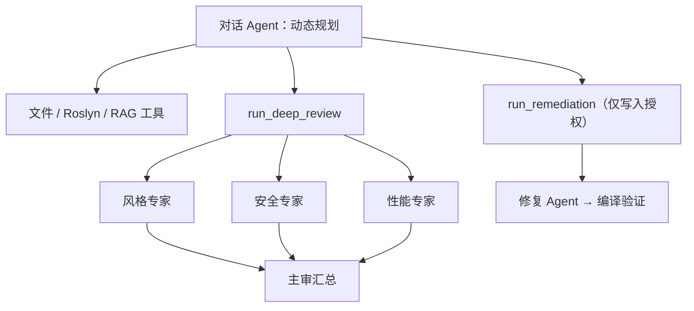
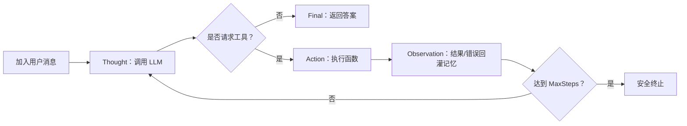

# 架构设计文档

## 1. 系统边界

系统由一个 Core 类库和两个独立入口组成：Web 提供面向人的代码审查工作台，MCP 通过 stdio 提供面向其它 AI 客户端的协议接口。两个入口均只依赖 Core，不互相引用。

## 2. 两层编排

顶层的对话 Agent 是唯一的交互入口。它在每轮对话中按需直接回答、调用细粒度工具，或将一次深度审查当作粗粒度动作调用。底层多 Agent 工作流则是固定的，便于展示并发、分工和可解释性。

## 3. ReAct 推理流程

`ReActAgent` 由项目手写控制循环；Semantic Kernel 仅提供工具 JSON Schema 和函数调用解析。这样“继续、调用、回灌、终止”均可在答辩中逐行解释。

每个阶段通过 `IAgentObserver` 上报 `step`、`thought`、`action`、`observation`、`final` 和可选的 `token`。Web 使用 `UiAgentObserver` 把这些事件调度回 Blazor UI，因此 Core 不依赖界面层。

## 4. 工具、Agent 与 MCP 工具的区别

| 类型 | 作用范围 | 示例 | 负责人 |
|---|---|---|---|
| 内部工具 | 被 ReAct Agent 在进程内调用 | `read_file`、`analyze_code`、`compile_check` | B |
| Agent | 用 LLM 进行判断并调用内部工具 | 安全专家、修复 Agent、对话 Agent | A |
| MCP 工具 | 经标准协议暴露给外部客户端 | `analyze_csharp`、`review_directory` | C |

内部工具负责能力，Agent 负责判断，MCP 工具负责跨进程接口；三者不应混为一谈。

## 5. Web 会话与目录安全

Web 页面只保留当前浏览器页面生命周期内的聊天历史。每个会话拥有一个 `ReActAgent` 和一份工作记忆；切换目录或切换写入权限会创建新的 Agent，避免不同项目的上下文混合。

- 上传 `.cs` 文件会写入 `ReviewWorkspace:UploadRoot` 下的随机会话目录；
- 外部目录通过 Core 的 `ReviewDirectoryPolicy` 验证；Web 与 MCP 使用同一份 `ReviewAccess` 配置；
- 外部目录默认只挂载读取、分析、检索和深度审查能力；用户显式授权后才增加 `propose_fix`、`compile_check` 与修复动作；
- 即便目录已获准，内部文件工具也只能通过相对路径操作审查根目录内的 `.cs` 文件，并拒绝目录穿越。

## 6. 配置、DI 与错误处理

配置遵循 `appsettings.json → appsettings.Local.json → 环境变量` 的覆盖顺序。`AddCodeReviewAgent` 负责注册 LLM、RAG、编排器和目录策略；Web 再注册上传工作区服务。

- 缺少 API Key 时拒绝创建 Kernel，不伪造模型答案；
- 工具异常被回灌给 Agent，使其可以选择其他操作；
- Web 将异常展示为系统消息；
- MCP 日志写 stderr，stdout 专用于 JSON-RPC；
- 网络相关测试使用接口桩，工具和路径策略测试可离线重复执行。

## 7. 待核对项

> TODO（组员 A）：补充最终使用的模型兼容端点和 ReAct 单测替身设计。

> TODO（组员 B）：核对 `propose_fix` 的最终补丁格式与 `.bak` 回滚演示步骤。

> TODO（组员 C）：在最终答辩前补入 Web 实机截图、MCP Inspector 截图和全量测试数量。
