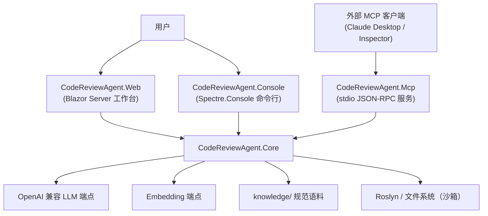
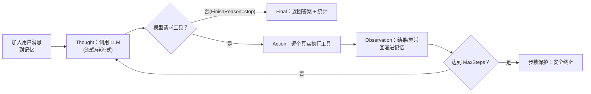
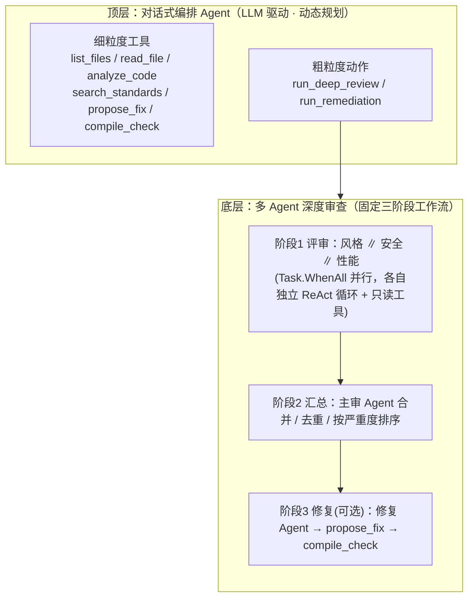
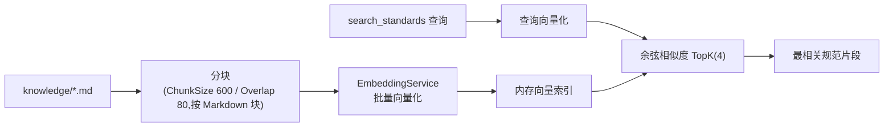
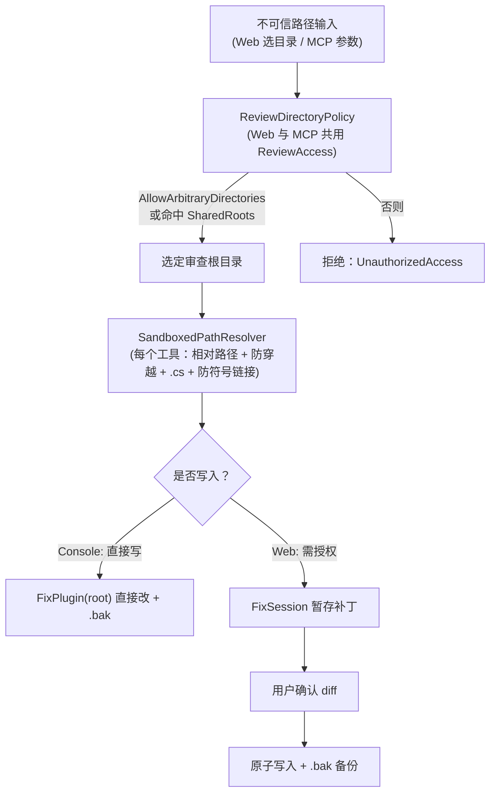

# 架构设计文档 · CodeReviewAgent

> 基于 .NET 8 的代码审查 AI Agent。本文描述系统的实际实现架构：一段手写的 ReAct 推理循环驱动工具调用，并以「对话式编排 Agent」为唯一入口，按需触发多 Agent 深度审查工作流；能力通过 Web、命令行（Console）与 MCP 三个对等入口对外提供。

---

## 1. 设计目标与原则

| 目标 | 落地方式 |
|---|---|
| 推理循环可解释，不被框架黑盒 | 手写 ReAct 循环，Semantic Kernel 仅做 JSON Schema 映射与函数调用解析（`autoInvoke: false`） |
| 四大要素（推理 / 工具 / 记忆 / 多 Agent）**组合咬合**而非孤立 | 多 Agent 深度审查被封装为顶层对话 Agent 的一个「动作工具」（agents-as-tools） |
| 一套 Core，多个入口 | Web / Console / MCP 均只依赖 Core，不含业务逻辑 |
| 真实大模型驱动| 缺 Key 立即显式抛错；所有推理与工具调用均真实执行 |
| 对用户代码的写入默认安全 | 多层沙箱 + 写入显式授权 + 暂存补丁 + `.bak` 备份 |

---

## 2. 系统边界与三入口

系统由一个 `CodeReviewAgent.Core` 类库和三个独立入口组成：**Web** 是面向人的审查工作台，**Console** 是等价能力的命令行对话入口（端到端演示 / 自测），**MCP** 通过 stdio 把能力暴露给其它 AI 客户端。三个入口均只依赖 Core、彼此不互调（依赖方向单一）。



入口差异仅在「界面 + 默认权限」：

| 入口 | 技术 | 交互 | 写入默认 | 可观测实现 |
|---|---|---|---|---|
| Web | Blazor Server（InteractiveServer） | 聊天 + 上传 / 选目录 + diff 确认 | 外部目录默认只读，需显式授权；写入走**暂存补丁** | `UiAgentObserver` |
| Console | Spectre.Console REPL | 终端对话 | 直接写入（演示用，默认 `allowWrites=true`） | `SpectreAgentObserver` |
| MCP | ModelContextProtocol stdio | JSON-RPC 工具调用 | 只读（仅暴露分析与深度审查） | `NullAgentObserver` |

---

## 3. 分层与项目结构

```
CodeReviewAgent.Core/            领域核心（不可单独运行）
├─ Agent/        ReActAgent（手写循环）、ConversationalAgentFactory、AgentResult
├─ Orchestration/ ReviewOrchestrator（多 Agent 三阶段）、PluginCatalog、
│                ReviewActionsPlugin（agents-as-tools）、ReviewPrompts
├─ Tools/        FileSystem / RoslynAnalysis / CodingStandards / Fix / CompileCheck
│                + SandboxedPathResolver + FixSession（暂存补丁）
├─ Rag/          IEmbeddingService/EmbeddingService、IKnowledgeBase/KnowledgeBase
├─ Memory/       ConversationMemory（滑动窗口）
├─ Llm/          KernelFactory（接 OpenAI 兼容端点）
├─ Abstractions/ IAgentObserver、NullAgentObserver
├─ Configuration/ AgentConfig 及各 Options、DirectoryLocator、ReviewDirectoryPolicy
└─ DependencyInjection.cs   AddCodeReviewAgent(...) 一次性注册全部服务

src/CodeReviewAgent.Web/         Blazor 工作台 + ReviewWorkspaceService + UiAgentObserver
src/CodeReviewAgent.Console/     REPL + SpectreAgentObserver + DiffRenderer + NativeConsole
src/CodeReviewAgent.Mcp/         McpReviewTools（[McpServerTool]）
tests/CodeReviewAgent.Tests/     xUnit 离线测试（接口桩隔离网络）
knowledge/                       async / exceptions / naming / performance / security / solid
samples/                         含缺陷示例（OrderService.cs）
```

`AddCodeReviewAgent` 是唯一的组合根：注册 `KernelFactory`、`PluginCatalog`、`ReviewOrchestrator`、`ConversationalAgentFactory`、`IEmbeddingService`、`IKnowledgeBase`、`ReviewDirectoryPolicy` 以及命名 HttpClient。三个入口各自只额外注册自己的界面层服务。

---

## 4. 核心：手写 ReAct 推理循环

`Agent/ReActAgent.cs` 是项目的核心，也是答辩需逐行讲解的部分。它用 Semantic Kernel 的**手动函数调用**模式（`FunctionChoiceBehavior.Auto(autoInvoke: false)`）：SK 只负责把工具描述成 JSON Schema、解析模型返回的工具调用请求；而「是否继续、执行哪个工具、如何回灌、何时停止」这套循环完全由本类掌控。



实现要点（对应 `RunAsync`）：

1. **记忆累积**：每轮用户输入先 `AddUserMessage`；多轮间复用同一 `ConversationMemory` 实例，因此对话「记得上文」。
2. **控制权归己**：`autoInvoke: false` 让 SK 把工具调用请求交回循环，而非自动执行后只给最终答案。
3. **终止条件**：模型不再请求工具即视为得出最终答案，立即返回；否则继续。
4. **工具失败不崩溃**：单个工具抛异常时，把「工具执行失败：…」作为 Observation 回灌，给模型改用其它工具 / 参数的机会。
5. **安全阀**：`MaxSteps`（默认 12）兜底，防止无限循环。

**流式与回退**：`Streaming` 开启时走 `GetStreamingChatMessageContentsAsync`，逐 token 经 `IAgentObserver.OnToken` 上报，并用 `FunctionCallContentBuilder` 增量拼装工具调用；若兼容端点的 SSE 流式与 SDK 的流式函数调用装配器不兼容，循环捕获异常并**自动回退到非流式**（回退结果同样是真实 LLM 调用）。返回元组携带 `Streamed` 标志，避免「流式已逐 token 输出」与「非流式一次性 OnThought」重复显示。

---

## 5. 两层编排：顶层动态 + 底层固定



**为什么两层职责不同：**

- **顶层对话 Agent 是动态规划者**（`ConversationalAgentFactory` 装配）：每轮由 LLM 自行决定直接回答、调用某个细粒度工具，还是触发整包动作。它拥有完整工具箱，是系统的唯一入口。
- **底层深度审查是固定工作流**（`ReviewOrchestrator`）：做全面审查时三视角恒定、结构已知，固定编排比动态规划更可预测、可解释、低成本。三位专家用 `Task.WhenAll` 并行（体现真实异步），各自是独立的 `ReActAgent` + 独立工作记忆 + 只读工具；主审 Agent 汇总；修复阶段按需触发。

**agents-as-tools**：`ReviewActionsPlugin` 把整套多 Agent 工作流包装成 `[KernelFunction]` 动作（`run_deep_review` / `run_remediation`）。于是多 Agent 不是另一条孤立入口，而是被对话 Agent「用起来」的一个动作——四大要素由此咬合。只读会话改用 `ReadOnlyReviewActionsPlugin`，刻意不暴露 `run_remediation`，确保未授权时模型既看不到也无法调用任何写入工作流。

**角色按「判断维度」分，工具按「能力」分**：风格 / 安全 / 性能 / 修复是需要 LLM 判断的**角色**；编译是确定性的 `compile_check`**工具**——不虚设「编译专家」。五个角色 Agent 复用同一 `ReActAgent`，仅 system prompt（`ReviewPrompts`）与挂载工具不同。

---

## 6. 工具体系

工具通过 `PluginCatalog` 这道「组装缝」按场景分组挂载，全部沙箱绑定到审查根目录。

| 工具（KernelFunction） | 插件 | 能力 | 读/写 |
|---|---|---|:--:|
| `list_files` / `read_file` | `FileSystemPlugin` (`files`) | 递归列出 `.cs`、带行号读取 | 读 |
| `analyze_code` | `RoslynAnalysisPlugin` (`roslyn`) | Roslyn 静态分析：空 catch、超长方法、魔法数、`async` 缺 `await`、命名、TODO，含行号 | 读 |
| `search_standards` | `CodingStandardsPlugin` (`standards`) | RAG 检索编码规范，为意见提供依据 | 读 |
| `propose_fix` | `FixPlugin` (`fix`) | 生成改写后内容；交互会话写入**暂存补丁**，修复 Agent 写工作副本 | 写 |
| `compile_check` | `CompileCheckPlugin` (`compile`) | Roslyn 编译到内存程序集，返回诊断，构成「分析→修复→验证」闭环 | 验证 |

按场景的三种组合（`PluginCatalog`）：

- `BuildReviewTools`：评审专家的**只读**集（files / roslyn / standards）。
- `BuildFixTools`：修复 Agent 的**读+改+验**集（files / fix / compile）。
- `BuildConversationTools`：顶层对话 Agent 的完整细粒度工具箱；`includeWriteTools=false` 时只挂只读工具；传入 `FixSession` 时 `propose_fix` 改为写暂存补丁（见 §10）。

**沙箱**：`SandboxedPathResolver` 统一解析路径，强制所有工具参数为相对路径、限定在审查根目录内、拒绝目录穿越，并对 `.cs` 扩展名与符号链接 / 重解析点做校验。

---

## 7. 记忆机制

`Memory/ConversationMemory` 封装 SK 的 `ChatHistory`，是课程要求的「记忆机制」：

- **短期 / 工作记忆合一**：System / User / Assistant / Tool 消息都在同一消息列表中；工具结果作为 Tool 消息累积。
- **多轮上下文来源**：同一实例在多轮间复用、历史不断追加——这是对话 Agent「记得上文」的根本。
- **滑动窗口防膨胀**：消息超过阈值（默认 40）时，**始终保留首条 System 提示**，从 index 1 起裁剪最早的普通消息，避免上下文无限增长撑爆 token 预算。

---

## 8. RAG 子系统



- **KnowledgeBase**：`InitializeAsync` 用 `DirectoryLocator` 向上定位 `knowledge/`，按 Markdown 块分块、批量向量化、存入内存向量列表（`SemaphoreSlim` 保证幂等、只初始化一次）；`SearchAsync` 把查询向量化后做余弦相似度，返回 TopK 片段。规模小，内存向量即可，无需外部向量库。
- **EmbeddingService**：HTTP 调 OpenAI 兼容 `/embeddings`。针对慢网络 / 批量上限做了工程加固：
  - **分批**：部分端点（DashScope `text-embedding-v3`）单批 ≤ 10，超出 400；按 `BatchSize` 切分后按序拼回。
  - **限并发并行**：`SemaphoreSlim`（并发 4）把多批耗时从「各批之和」降到接近「最慢批」。
  - **瞬时错误重试**：对 TLS EOF / 连接重置 / 超时等线性退避重试（最多 3 次）；参数类错误不重试，直接抛出并附响应体便于排错。
  - **专用 HttpClient**：命名客户端超时 30s，让慢请求快速失败换新连接重试，而非干等默认 100s。

---

## 9. 可观测性

`Abstractions/IAgentObserver` 是 Core 与界面层之间的依赖倒置边界——Core 只依赖此抽象，界面去实现它，这也是引擎与界面能并行开发的关键。

事件：`OnStep` / `OnThought` / `OnAction` / `OnObservation` / `OnFinalAnswer` / `OnToken`。

| 实现 | 用途 |
|---|---|
| `UiAgentObserver`（Web） | 把事件 `InvokeAsync(StateHasChanged)` 调度回 Blazor，实时渲染推理轨迹 |
| `SpectreAgentObserver`（Console） | 渲染为终端轨迹：按 Agent 着色、顶层对话逐 token 流式、修改前后 diff |
| `NullAgentObserver`（MCP / 测试 / 主审） | 空实现，不关心轨迹的场景复用同一单例 |

多专家并行阶段刻意关闭逐 token 流式（`Streaming=false`），避免多路 token 在同一界面交织；仍输出原子化的 步 / 动作 / 观察 事件。

---

## 10. 安全与目录权限



三道防线：

1. **目录准入**——`ReviewDirectoryPolicy` 为 Web 与 MCP 统一解析不可信路径，由 `ReviewAccess`（`AllowArbitraryDirectories` / `SharedRoots`）决定能否选中。开发环境可放开任意目录，生产环境应关闭并列出可信根。
2. **工具沙箱**——即便目录已准入，每个工具的 `SandboxedPathResolver` 仍只允许相对路径、限定根目录内、拒绝穿越与符号链接。
3. **写入授权 + 暂存补丁**——Web 的外部目录默认只读；开启「允许修改」后，`propose_fix` 只能通过 `FixSession.Stage` 生成**待确认补丁**（含 unified diff），不碰源文件；用户确认后 `Apply` 才**原子写入**并首次修改前创建 `.bak`，支持查看 `.bak` 与单文件回滚。原文件在生成补丁后若已变化则拒绝应用。Console 为演示便利默认直接写入（同样有 `.bak`）。

---

## 11. 配置、DI 与错误处理

- **分层配置**：每个入口 `appsettings.json`（非机密默认值，提交）→ `appsettings.Local.json`（机密，gitignore）→ 环境变量（最高优先级）。密钥不入源码、不入库。
- **LLM 接入**：`KernelFactory` 用 `OpenAIClientOptions.Endpoint` 把官方 OpenAI SDK 指向任意兼容端点（glm / qwen / deepseek / Ollama 等）。因文件系统工具需按审查根沙箱，Kernel **按会话创建**而非全局单例。
- **缺 Key 显式失败**：`KernelFactory.CreateKernel` 在 `IsConfigured==false` 时立即抛出可操作的错误，绝不用假数据冒充。
- **错误回灌而非崩溃**：工具异常作为 Observation 回灌；Web 把异常显示为系统消息；MCP 把可行动诊断作为正常工具结果返回、完整异常写 stderr。
- **MCP 协议纪律**：stdout 专用于 JSON-RPC，所有日志走 stderr（`LogToStandardErrorThreshold`），否则破坏协议帧。

---

## 12. 测试策略

`tests/CodeReviewAgent.Tests`（xUnit）覆盖工具、RAG、记忆、目录策略、权限与 MCP 工具，全部**离线可重复**：

- 网络调用用接口桩隔离（`StubHttpMessageHandler` 假 embedding、`TemporaryDirectory` 临时沙箱），不触达真实 LLM / 网络。
- 工具与路径策略可直接 `new` 出来传入临时目录断言。
- 关键集成点（Part B 工具、对话工具权限、目录策略、FixSession、MCP 工具）均有专门用例。

> 运行：`dotnet test`。当前 110 个用例全绿。

---

## 13. 关键设计决策（ADR 摘要）

| 决策 | 取舍 |
|---|---|
| 手写 ReAct + `autoInvoke:false` | 牺牲少量便利，换取循环每一行可讲解、不被黑盒化（核心评分项） |
| 顶层动态、底层固定 | 全面审查结构已知，固定工作流更可预测；动态规划只留给「要不要触发」 |
| 多 Agent 作为「动作工具」 | 让多 Agent 融入主交互流，而非另起一条孤立入口 |
| 角色（判断）/ 工具（能力）分离 | 避免为每个工具虚设 Agent 的形式主义 |
| 内存向量 + 余弦相似度 | 语料规模小，免去外部向量库的部署成本 |
| 暂存补丁 + 显式写授权 | 避免一句「审查一下」意外改动真实代码 |
| 缺 Key 即失败 | 杜绝「看似能用」的假数据，保证演示与评分真实 |

---

## 14. 技术栈

| 维度 | 选型 |
|---|---|
| 语言 / 运行时 | C# / .NET 8 (LTS) |
| Agent 框架 | Semantic Kernel（手动函数调用） |
| LLM 接入 | OpenAI 兼容端点（默认 DashScope compatible-mode，模型可配置） |
| 静态分析 | Roslyn（`Microsoft.CodeAnalysis.CSharp`） |
| RAG | HTTP embedding + 内存向量 + 余弦相似度 |
| MCP | 官方 `ModelContextProtocol` C# SDK（stdio） |
| Web | Blazor Server（InteractiveServer 渲染） |
| Console | Spectre.Console（REPL + 推理轨迹 + diff） |
| 测试 | xUnit（接口桩离线） |
| 配置 / DI / 日志 | `IConfiguration` 分层、`IServiceCollection`、`ILogger` |

---

## 15. 评分要素映射

| 评分维度 | 本架构对应 |
|---|---|
| Agent 核心功能 | §4 手写 ReAct（终止 / 回灌 / 步数保护 / 流式回退）、§6 六工具、§5 多步推理与边界处理 |
| 技术实现质量 | §3 分层、§8 异步并行、§11 错误处理、§13 SOLID 取舍 |
| .NET 技术深度 | Roslyn / Blazor / SK / MCP SDK / 分层配置 / DI / 命名 HttpClient |
| 架构设计文档 | 本文（边界 / 流程 / 工具 / 安全 图文） |
| 加分项 | 多 Agent 协作（§5）、RAG（§8）、MCP（§2）、可观测 / 流式（§9）、单元测试（§12）、三入口（§2） |
