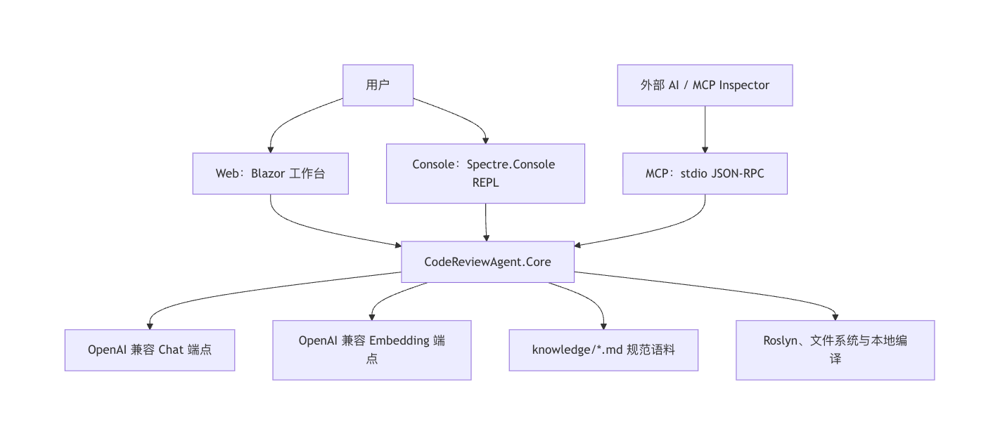
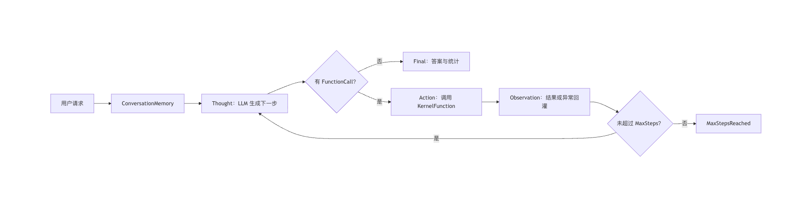
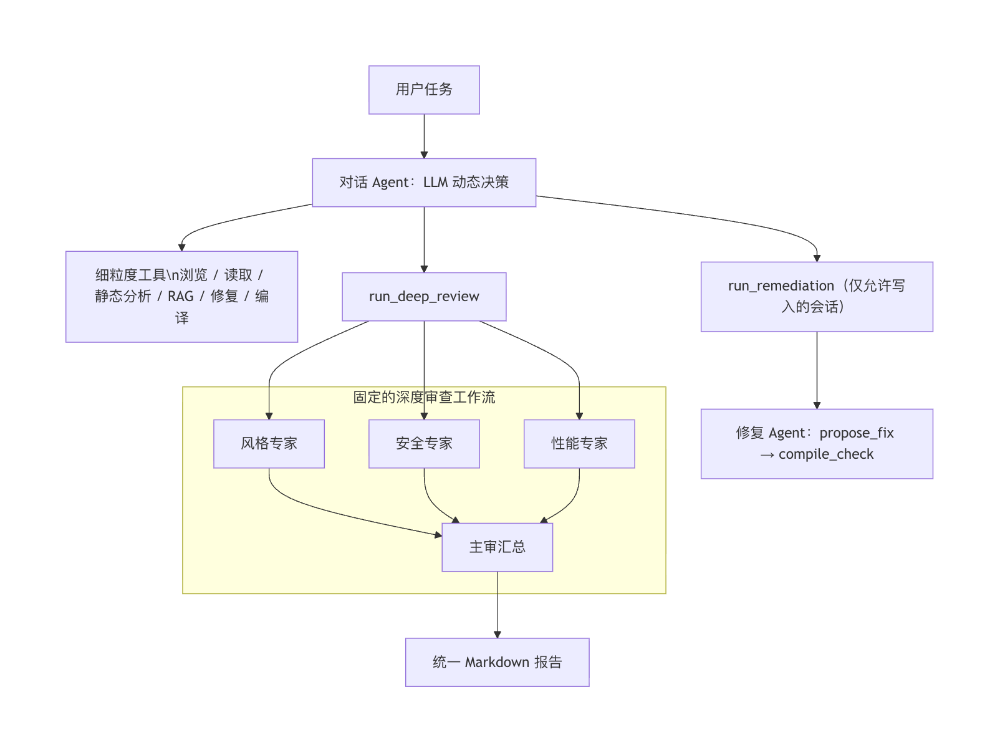
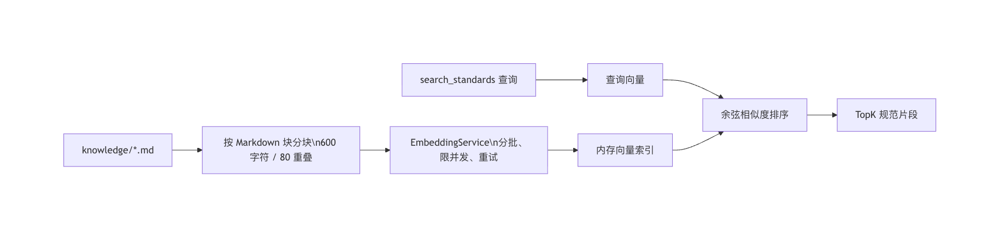
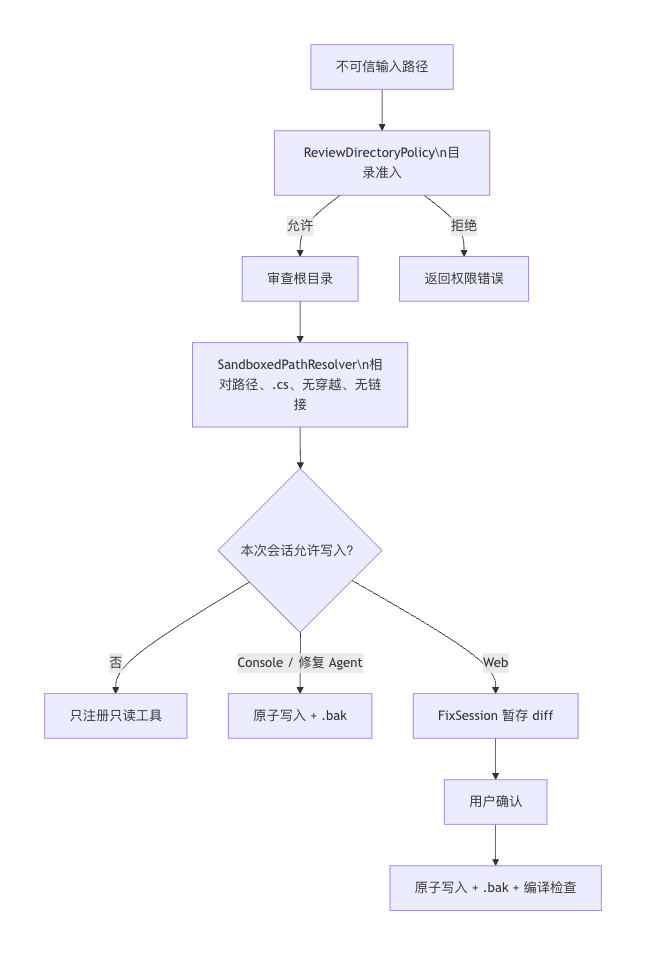
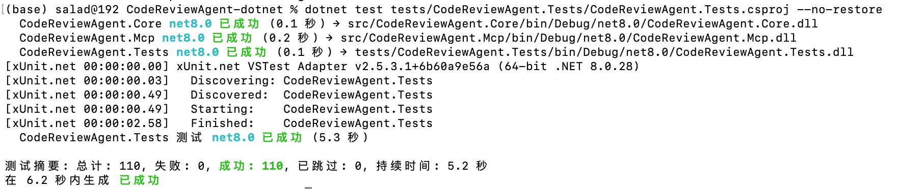

# 架构设计文档 · CodeReviewAgent

## 1. 系统定位

CodeReviewAgent 是一个基于 .NET 8 的 C# 代码审查 Agent。系统通过手写 ReAct 循环让大语言模型在“思考—调用工具—观察结果”之间迭代，并在用户要求全面审查时触发多专家协作。它的设计重点是：模型的推理可以利用工具，但文件访问、静态分析、编译验证和写入授权都必须由确定性的 .NET 代码约束。

系统满足以下原则：

| 原则 | 对应实现 |
|---|---|
| 推理过程可解释 | `ReActAgent` 使用 `autoInvoke: false` 手动控制工具循环，并经 `IAgentObserver` 输出轨迹。 |
| 一套业务核心 | Web、Console、MCP 均只依赖 `CodeReviewAgent.Core`，入口之间不互相依赖。 |
| 判断与执行分离 | LLM Agent 负责审查判断和任务规划；Roslyn、文件系统、编译器和权限策略负责确定性操作。 |
| 默认安全 | 目录准入、路径沙箱、显式写入授权、暂存补丁和 `.bak` 备份形成分层保护。 |
| 可离线验证 | 网络依赖通过接口桩隔离，核心工具和策略由 xUnit 覆盖。 |

## 2. 系统边界与入口

`CodeReviewAgent.Core` 是唯一包含审查业务逻辑的类库。Web 面向普通用户提供聊天、上传、补丁确认和推理轨迹；Console 面向命令行演示与本地交互；MCP 以 stdio JSON-RPC 向其他 AI 客户端提供标准工具。三者共享配置模型和 Core 服务，但拥有不同的展示方式与默认写入策略。




## 3. 代码组织与依赖方向

```text
src/
├─ CodeReviewAgent.Core/
│  ├─ Agent/          ReActAgent、ConversationalAgentFactory、AgentResult
│  ├─ Orchestration/  ReviewOrchestrator、PluginCatalog、ReviewActionsPlugin、Prompts
│  ├─ Tools/          文件、Roslyn、修复、编译、路径沙箱、暂存修复会话
│  ├─ Rag/            EmbeddingService、KnowledgeBase 及其抽象
│  ├─ Memory/         ConversationMemory
│  ├─ Llm/            KernelFactory
│  ├─ Configuration/  Options、目录定位与目录准入策略
│  └─ Abstractions/   IAgentObserver
├─ CodeReviewAgent.Web/      Blazor 工作台与上传工作区服务
├─ CodeReviewAgent.Console/  REPL、终端观察者与 diff 渲染
└─ CodeReviewAgent.Mcp/      MCP 工具适配层

tests/CodeReviewAgent.Tests/  xUnit 离线测试
knowledge/                    六类编码规范语料
samples/                      含典型问题的演示代码
```

依赖从入口流向 Core，再由 Core 访问外部模型端点和本地基础设施。`AddCodeReviewAgent` 是 Core 的组合根：它注册 `KernelFactory`、`PluginCatalog`、`ReviewOrchestrator`、`ConversationalAgentFactory`、`ReviewDirectoryPolicy`、`IEmbeddingService`、`IKnowledgeBase` 和 embedding 专用 `HttpClient`。Kernel 不作为全局单例，因为每次会话挂载的文件工具必须绑定不同的审查根目录。

## 4. ReAct 推理循环与记忆

`ReActAgent.RunAsync` 是 Agent 的执行核心。每次用户输入先加入 `ConversationMemory`，然后循环调用模型。若模型仅返回文本，循环结束；若模型返回函数调用，系统逐个真实执行工具，再将结果写为 Tool 消息，让模型能依据 Observation 做下一步判断。单个工具失败被转为 Observation，而非使整个会话崩溃；达到 `Agent.MaxSteps`（默认 12）时安全停止。




Semantic Kernel 在这里负责模型协议适配、工具 Schema 和函数调用解析；循环控制权仍在项目代码中，具体体现为 `FunctionChoiceBehavior.Auto(autoInvoke: false)`。`Streaming=true` 时，`GetStreamingChatMessageContentsAsync` 会把 token 上报给观察者，并用 `FunctionCallContentBuilder` 拼装工具调用；出现兼容性异常时，代码自动尝试非流式调用。

`ConversationMemory` 将 System、User、Assistant 和 Tool 消息保存在同一 `ChatHistory` 中。超过默认 40 条消息后，它总是保留首条系统提示，并从最早的普通消息开始裁剪，从而在保留近期工具证据和上下文的同时限制历史膨胀。

## 5. 两层 Agent 编排

顶层对话 Agent 是动态规划层：它根据用户意图选择读取一个文件、执行静态分析、检索规范，或调用全面审查这样的粗粒度动作。`ReviewActionsPlugin` 将多 Agent 编排包装为 `run_deep_review` 与 `run_remediation`，实现 agents-as-tools；只读会话改用 `ReadOnlyReviewActionsPlugin`，从工具 Schema 中彻底移除修复动作。

底层深度审查是固定流程。风格、安全和性能专家使用不同的 system prompt、独立 Kernel、独立记忆和只读工具集；它们通过 `Task.WhenAll` 并行执行。主审 Agent 不访问工具，只对三份意见去重、分级并形成统一报告。修复阶段只接收已确认的问题清单，使用读、改、验工具完成闭环。



这种划分将动态性放在真正需要判断的地方：用户到底需要什么、下一步该取什么证据；将固定性放在全面审查这种结构已知的工作中。并行专家关闭逐 token 流式输出，避免多路文本交错，但仍会报告原子化的步骤、动作和 Observation。

## 6. 工具体系

所有 Agent 工具由 `PluginCatalog` 按使用场景装配，工具参数均经审查根目录约束。

| Kernel 函数 | 实现 | 作用 | 场景 |
|---|---|---|---|
| `list_files`、`read_file` | `FileSystemPlugin` | 递归列出 `.cs`；按行号读取源码 | 评审、修复、对话 |
| `analyze_code` | `RoslynAnalysisPlugin` | 发现语法诊断、空 catch、超长方法、魔法数字、`async` 缺直属 `await`、命名和维护标记 | 评审、对话 |
| `search_standards` | `CodingStandardsPlugin` | 从规范知识库检索相关条款 | 评审、对话 |
| `propose_fix` | `FixPlugin` | 接收完整新文件内容；直接写入或生成待确认 diff | 修复、允许写入的对话 |
| `compile_check` | `CompileCheckPlugin` | 使用 Roslyn 编译单个文件到内存程序集，并返回错误/警告 | 修复、允许写入的对话 |
| `run_deep_review`、`run_remediation` | `ReviewActionsPlugin` | 将多 Agent 工作流作为对话 Agent 的粗粒度动作 | 对话 |

`BuildReviewTools` 只组装浏览、分析与规范检索；`BuildFixTools` 组装浏览、修复与编译；`BuildConversationTools` 根据 `allowWrites` 和是否传入 `FixSession` 决定是否加入写工具。因此只读权限并非依赖模型“自觉不修改”，而是在 Kernel 层根本不注册可写函数。

## 7. RAG：从规范语料到审查依据

知识库语料包含命名、异常与资源管理、异步、安全、性能和 SOLID 六个主题。首次检索时，`KnowledgeBase` 通过 `DirectoryLocator` 找到 `knowledge/`，按 Markdown 段落和默认 600 字符窗口（80 字符重叠）切分，批量请求 embedding 后驻留在内存。随后查询文本也会向量化，并以余弦相似度选取默认 Top 4 片段。



`EmbeddingService` 默认复用 LLM 的端点和 Key，也允许单独配置。为适应兼容端点的批量上限，它按 `Embedding.BatchSize`（默认 10）切分文本、最多并发四个请求，并只对网络超时、连接重置等瞬时错误进行最多三次线性退避重试。返回值会恢复输入顺序，且会验证数量、索引和向量维度。

## 8. 安全模型与修复流程

系统将“能否选择目录”“工具能否访问路径”“能否真正写入”拆成三层，而不是只依赖一次前端校验。



1. `ReviewDirectoryPolicy` 根据 `ReviewAccess.AllowArbitraryDirectories` 与 `SharedRoots` 验证 Web、MCP 传入的目录或 C# 文件。生产环境应关闭任意目录模式并配置可信根。
2. `SandboxedPathResolver` 只接受相对审查根目录的路径，拒绝绝对路径、目录穿越、非 `.cs` 文件、符号链接和重解析点。
3. `FixPlugin` 直接模式写入前保留原始 `.bak`；`FixSession` 模式仅在内存保存 `PendingFix`，应用前比较原始内容以防覆盖并发手工修改，并用临时文件加 `File.Move(..., overwrite: true)` 原子替换。Web 允许查看备份和单文件回滚。

## 9. 配置、依赖注入与错误处理

每个可执行项目采用 `appsettings.json → appsettings.Local.json → 环境变量` 的配置层次；`appsettings.Local.json` 已被 `.gitignore` 排除，API Key 不进入仓库。`KernelFactory` 在创建 Kernel 前检查 `Llm.ApiKey`，缺少 Key 时给出明确错误，绝不伪造审查结论。

对于可恢复问题，系统尽量提供上下文而不吞掉失败：工具异常回灌给 Agent；Web 显示系统消息；MCP 记录完整异常到 stderr，并把可操作的诊断作为工具结果返回。`CompileCheckPlugin` 对 C# 文件编译结果按行号、列号和诊断编号返回；`EmbeddingService` 在非成功 HTTP 响应中截取响应体辅助排错，但不在文档或日志中输出配置的密钥。

## 10. 测试与质量保障

测试项目使用 xUnit 和临时目录，网络依赖用 `StubHttpMessageHandler`、假的 `IEmbeddingService` 与假的 `IKnowledgeBase` 隔离，因此可以离线重复执行。当前测试套件共 110 个用例，覆盖范围包括：

- 文件列举、带行号读取、通配过滤和路径拒绝；
- Roslyn 规则及其稳定排序；
- 单文件编译诊断；
- 直接修复、备份、暂存 diff、应用前内容校验和回滚；
- embedding 请求构造、输入顺序、异常和配置回退；
- 知识库分块、幂等/并发初始化、余弦检索与稳定排序；
- Web/MCP 共用的目录访问策略和 MCP 静态分析边界；
- “列出—读取—分析—修复—编译”的离线集成闭环。

执行命令：

```bash
dotnet test tests/CodeReviewAgent.Tests/CodeReviewAgent.Tests.csproj --no-restore
```



## 11. 技术栈

| 类别 | 选型 |
|---|---|
| 运行时 | C# / .NET 8 |
| Agent 与工具协议 | Semantic Kernel 1.77，手动函数调用 |
| LLM 与 Embedding | OpenAI 兼容 HTTP 端点 |
| 静态分析与编译 | Microsoft.CodeAnalysis.CSharp（Roslyn） |
| RAG | 内存向量索引 + 余弦相似度 |
| 人机界面 | Blazor Server（InteractiveServer）、Markdig |
| 终端界面 | Spectre.Console |
| 外部 Agent 接口 | ModelContextProtocol C# SDK，stdio 传输 |
| 测试 | xUnit、接口桩、临时文件系统 |

这套架构并不试图让模型替代编译器、权限系统或人工确认；相反，它把模型放在最适合的位置——理解用户意图、选择证据和综合审查意见——并用 .NET 工具链把结果锚定到可验证的工程行为上。

## 12. 局限性与后续改进

当前系统已经实现了可解释的 ReAct 工具调用、多专家审查、RAG 规范检索和安全修复闭环，但仍存在一些局限。

第一，当前编译验证以单个 C# 文件为主，能够发现语法错误和部分引用问题，但还不能完全替代真实项目级构建。后续可以接入 `dotnet build`，在隔离工作区中执行完整解决方案编译，并返回项目级诊断结果。

第二，RAG 知识库目前采用内存向量索引，适合课程项目和小规模规范语料，但在规范数量增大、需要跨项目共享知识时，可能需要接入持久化向量数据库，并增加知识版本管理机制。

第三，当前多专家 Agent 的分工主要覆盖风格、安全和性能三个维度，后续可以扩展测试专家、架构专家和可维护性专家，使审查结果更加接近真实工程 Code Review 流程。

第四，修复阶段目前以完整文件替换和 diff 确认为主，虽然安全性较高，但对大型文件而言 token 成本较高。后续可以改进为基于局部补丁的修复策略，并在应用前进行更细粒度的冲突检测。

第五，当前系统主要面向 C#/.NET 项目，Roslyn 分析和编译工具与语言强绑定。未来如果要支持 Java、Python 或 TypeScript，需要抽象出语言适配层，并为不同语言配置对应的静态分析器、编译器或测试命令。
