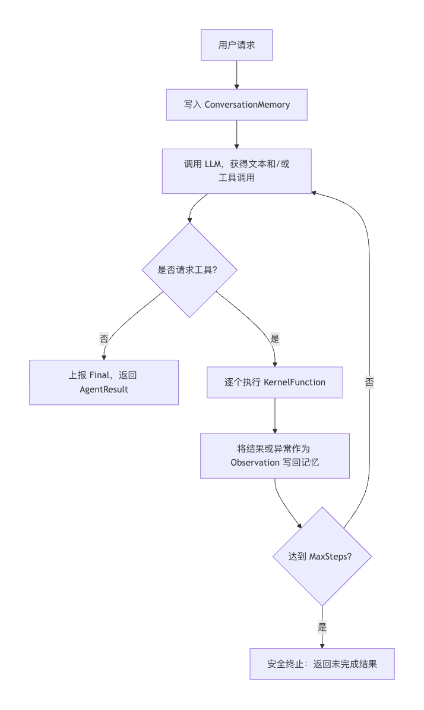
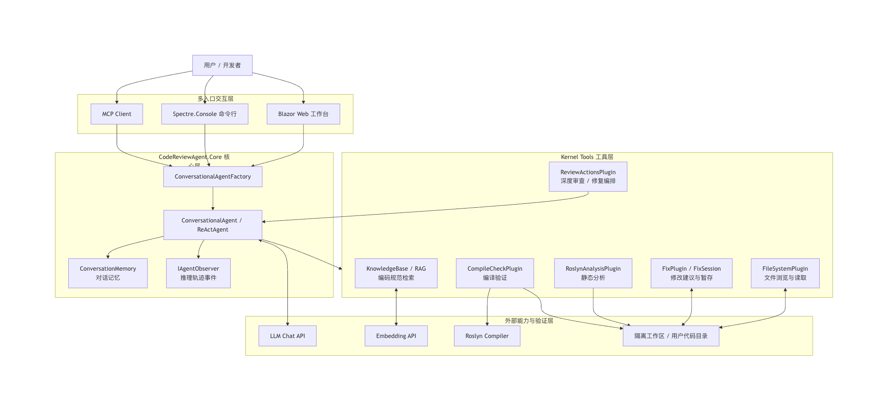
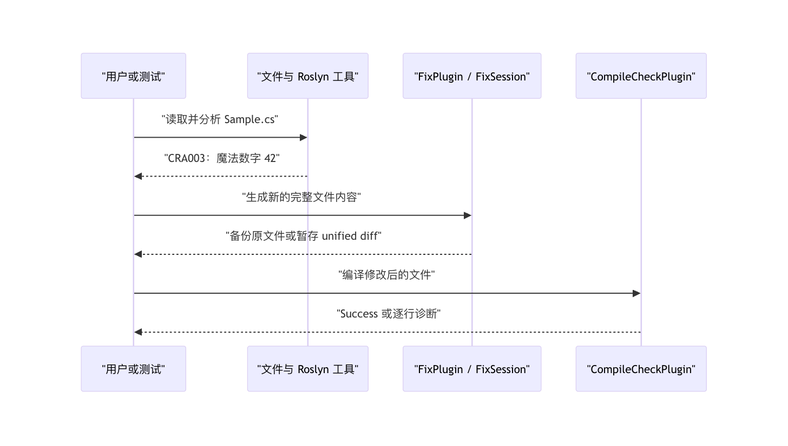

# 反思报告

## 1. 项目回顾

本项目实现了一个面向 C#/.NET 的代码审查 Agent。用户可以从 Blazor Web 工作台、Spectre.Console 命令行或 MCP 客户端进入系统；三个入口复用同一个 `CodeReviewAgent.Core`，避免界面层重复实现审查逻辑。系统以对话 Agent 为统一入口：它可根据用户请求浏览文件、读取代码、执行 Roslyn 静态分析、检索编码规范、生成修改建议和编译验证，也可把“全面审查”委派给风格、安全、性能三个专家并行完成。

项目完成了课程要求中的 .NET 8、LLM API、手写 ReAct 循环、自定义工具、记忆机制和交互界面；同时加入了多 Agent 协作、RAG、MCP、推理轨迹和离线单元测试。开发结束时，`dotnet test tests/CodeReviewAgent.Tests/CodeReviewAgent.Tests.csproj --no-restore` 通过 110 个测试用例。

## 2. 核心实现反思：手写 ReAct 循环

`src/CodeReviewAgent.Core/Agent/ReActAgent.cs` 是整个系统最重要的控制点。我们没有把函数调用完全交给框架自动执行，而是使用 Semantic Kernel 的 `FunctionChoiceBehavior.Auto(autoInvoke: false)`：框架负责把 C# 方法转换为模型可理解的工具 Schema，并解析模型返回的函数调用；是否继续推理、何时执行工具、如何处理异常和什么时候停止，由项目代码显式控制。

一次 `RunAsync` 调用的关键步骤如下：

1. 用户文本通过 `AddUserMessage` 进入同一份 `ConversationMemory`；复用同一个 Agent 实例时，前一轮的用户消息、模型回复和工具 Observation 会保留给下一轮。
2. 循环为每一步创建带有温度、最大输出长度和手动函数调用策略的 `OpenAIPromptExecutionSettings`，然后调用模型。
3. 如果模型没有返回 `FunctionCallContent`，循环把文本视为最终答案，触发 `OnFinalAnswer` 并以完成状态返回。
4. 如果模型请求工具，循环逐个调用 `call.InvokeAsync(_kernel, ct)`；任何单个工具异常都会转为“工具执行失败：…”的 Observation 写回历史，而不是直接中断整次审查。
5. 达到配置的 `MaxSteps`（默认 12）仍未收敛时，返回 `MaxStepsReached`，避免模型在重复工具调用中无限循环。

这套实现的价值不只在于“能调用工具”，还在于过程可解释。`IAgentObserver` 在每一步发送 step、thought、action、observation、final 和 token 事件；Web 将其渲染为实时轨迹，Console 将其渲染为分角色的终端输出。流式模式下，代码用 `FunctionCallContentBuilder` 重建流式函数调用；若兼容端点的流式协议无法正确装配工具调用，则自动回退为非流式请求，保证审查仍然使用真实模型而不是伪造结果。

## 3. 架构决策与取舍

### 3.1 顶层动态决策，底层固定编排

系统没有把“单 Agent”和“多 Agent”设计成两个互不相干的入口。`ConversationalAgentFactory` 创建的对话 Agent 是唯一的任务入口，它可以根据用户意图决定使用细粒度工具，或调用 `ReviewActionsPlugin` 提供的 `run_deep_review`、`run_remediation` 粗粒度动作。

全面审查的内容和顺序相对稳定，因此 `ReviewOrchestrator` 使用固定的三阶段工作流：三个专家各自运行独立 ReAct 循环并通过 `Task.WhenAll` 并行；主审 Agent 只整合已有意见，按严重程度去重和排序；仅在获得已确认问题清单时才进入修复阶段。这比让模型每次临时决定是否需要某一位专家更容易预测、展示和测试。

### 3.2 角色与工具分离

风格、安全、性能和修复是不同的判断视角，因此由不同 system prompt 驱动的 Agent 角色承担；文件读取、Roslyn 分析、RAG 检索和编译检查是确定性能力，因此被实现为 `[KernelFunction]` 工具。这个边界让模型负责需要上下文判断的部分，让代码负责可验证的机械操作，避免为了“多 Agent”而给每个工具虚构一个角色。

### 3.3 写入前先授权，再确认

代码审查系统最容易造成的损害不是漏报问题，而是未经确认修改用户源码。为此，上传文件会先复制到隔离会话工作区；外部目录进入 Web 后默认为只读。用户开启写权限时，Web 不把 `propose_fix` 直接连到原文件，而是用 `FixSession` 暂存完整的新内容与 unified diff。用户确认后才会原子写入，并在首次修改前创建 `.bak` 备份；原文件在生成补丁后已经变化时，系统拒绝应用该补丁。Console 的直接修复面向演示场景，仍会生成 `.bak`；MCP 则只暴露只读分析和深度审查能力。

### 3.4 小规模 RAG 采用内存索引

知识库只有六份主题明确的 Markdown 规范，使用外部向量数据库会增加部署复杂度而没有相称收益。因此 `KnowledgeBase` 在首次使用时将文档按 Markdown 块和重叠窗口切分，调用 embedding 接口建立内存索引，并用余弦相似度取 TopK 结果。实现对批量长度、并发、瞬时网络失败和向量维度做了校验；`SemaphoreSlim` 保证并发初始化只真正执行一次。这个选择体现了“按规模选择技术”的原则，而不是为了堆砌组件而引入额外服务。

## 4. 关键问题、处理方式与证据

| 问题 | 处理方式 | 代码或测试证据 |
|---|---|---|
| 不同入口可能对目录权限理解不一致 | 将目录准入抽到 `ReviewDirectoryPolicy`，由 Web 和 MCP 共同调用；目录内工具仍使用独立沙箱。 | `ReviewDirectoryPolicyTests` 覆盖允许根目录、子目录、越界目录和非 `.cs` 文件。 |
| 相对路径可能绕过审查根目录 | `SandboxedPathResolver` 拒绝绝对路径、`..` 穿越、同前缀兄弟目录和符号链接/重解析点。 | `SandboxedPathTests` 覆盖路径穿越、绝对路径、兄弟目录和扩展名限制。 |
| 多专家同时流式输出会交错，造成界面不可读 | 专家 Agent 设置 `Streaming=false`，只输出完整的步骤、动作和 Observation；顶层对话可保持流式。 | `ReviewOrchestrator.RunSpecialistAsync` 为专家单独构造非流式 `ReActOptions`。 |
| embedding 服务在端点限制或瞬时网络异常下不稳定 | 实现按 `BatchSize` 分批、最多四批并发、最多三次线性退避重试，并使用 30 秒命名 `HttpClient`。 | `EmbeddingServiceTests` 和 `KnowledgeBaseTests` 覆盖输入排序、异常、幂等初始化、并发初始化及检索排序。 |
| 修复建议可能覆盖用户刚刚手动改过的源码 | 暂存时保存原始内容；应用前重新读取并比较，内容不一致就拒绝写入。 | `FixSessionTests` 覆盖暂存、应用、源文件变化拒绝和回滚。 |

## 5. 一次可重复的“发现—修复—验证”闭环

项目用 `PartBIntegrationTests.ToolChain_ListReadAnalyzeFixCompile_Completes` 固化了无需网络即可重复执行的闭环：在临时目录创建 `Sample.cs`，其中方法直接返回魔法数字 `42`；`FileSystemPlugin` 列出并读取该文件后，`RoslynAnalysisPlugin` 给出 `CRA003`；`FixPlugin` 将 `42` 提取为 `private const int Answer = 42` 并写入修改前的 `.bak` 备份；最后 `CompileCheckPlugin` 用 Roslyn 编译修改后的文件，断言结果以 `Success` 开头。

这个闭环比仅让模型提出文字建议更可靠：静态规则提供可定位的客观发现，修改路径有备份或显式确认，验证路径使用编译器而非模型自我判断。它也暴露了当前限制：`compile_check` 按单个 C# 文件和运行时可信平台程序集编译，不能代替完整解决方案的依赖还原、项目配置和集成测试。

## 6. AI 辅助开发的使用边界

本项目将生成式 AI 作为开发辅助，而不作为最终正确性的来源。AI 主要用于梳理实现方案、生成界面和文档的初稿、讨论提示词表达，以及协助定位常见 API 使用问题；最终代码由小组成员结合 .NET、Semantic Kernel、Roslyn 和 MCP 的实际 API 进行修改、审阅和集成。

| 模块 | AI 辅助的适用范围 | 人工复核与最终责任 |
|---|---|---|
| Agent 与提示词 | 协助比较 ReAct 流程、角色边界和提示词表述 | 人工决定 `autoInvoke:false`、终止条件、异常回灌和步数上限，并以源码检查确认。 |
| Tools 与 RAG | 协助列举静态规则、检索流程和边界情形 | 人工以 Roslyn API、路径沙箱、HTTP 响应校验和离线测试验证。 |
| Web、Console、MCP | 协助界面文案、交互草图和协议使用示例 | 人工确认 Blazor 生命周期、stdout/stderr 协议隔离和写入授权流程。 |
| 文档 | 协助组织结构、提炼设计理由和绘制图示 | 文档结论以仓库源码、配置和测试结果为准。 |

这次实践提醒我们：AI 很适合扩大方案搜索范围和减少重复性表达工作，但涉及权限、并发、协议和代码修改的结论必须回到可运行代码与测试。特别是本项目不允许在缺少 API Key 时伪造模型结果，体现了“真实状态优先于看似可演示”的工程原则。

## 7. 不足与后续改进

- 对话记忆目前只存在于页面或 Console 会话生命周期内；后续可引入用户身份、持久化会话和可审计的摘要策略。
- `compile_check` 适合验证单文件语法与基础引用，后续可增加受控的 `dotnet build` 级验证、项目依赖分析及测试回归。
- `FixSession` 当前生成的是整文件 unified diff；可进一步支持按 hunk 确认、冲突提示和多文件事务。
- RAG 索引驻留内存，适合课程项目的少量语料；若规范和历史审查记录持续增长，可评估持久化向量库与增量索引。
- MCP 已提供标准化只读入口，但仍可增加真实 MCP 客户端端到端测试、细粒度授权和审计日志。

总体而言，本项目最重要的收获不是把 LLM 接进 .NET，而是建立了可解释、可验证、可约束的工作流：模型负责判断与规划，工具负责证据与操作，用户保留写入确认权，测试覆盖可离线验证的关键边界。
